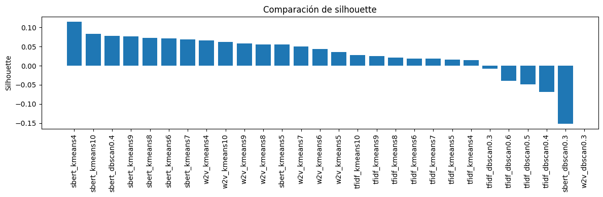
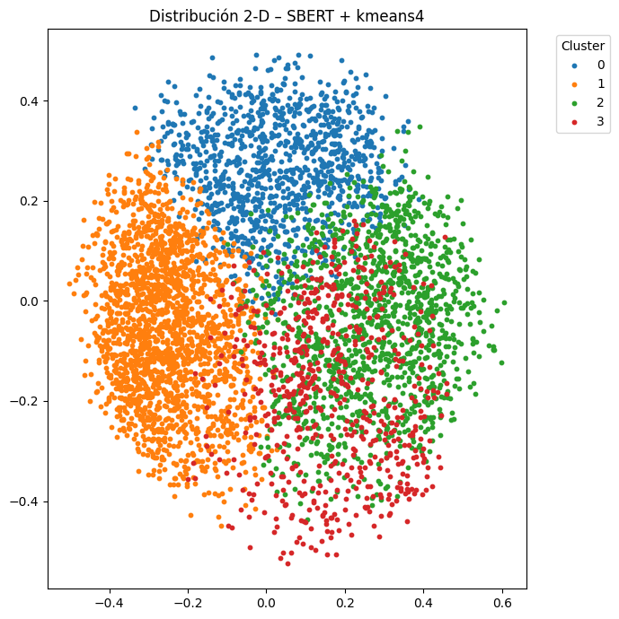
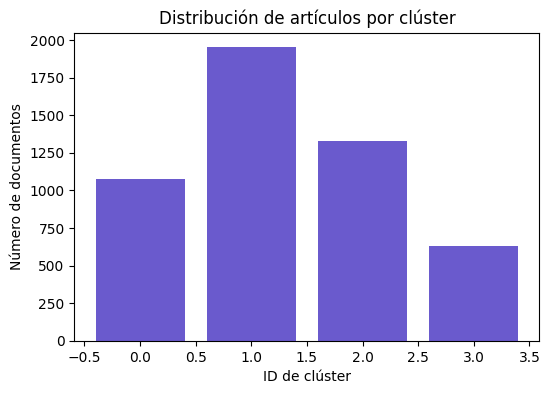
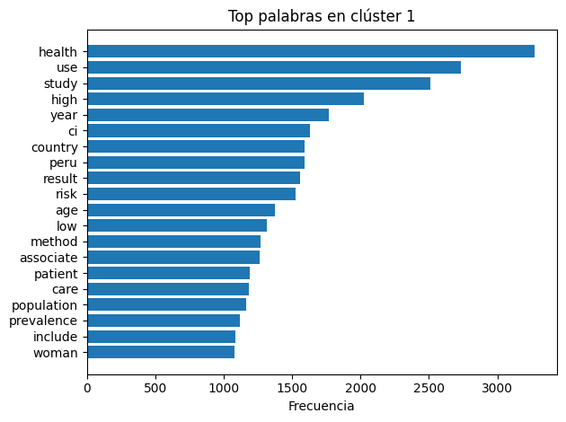
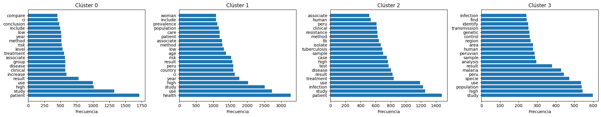
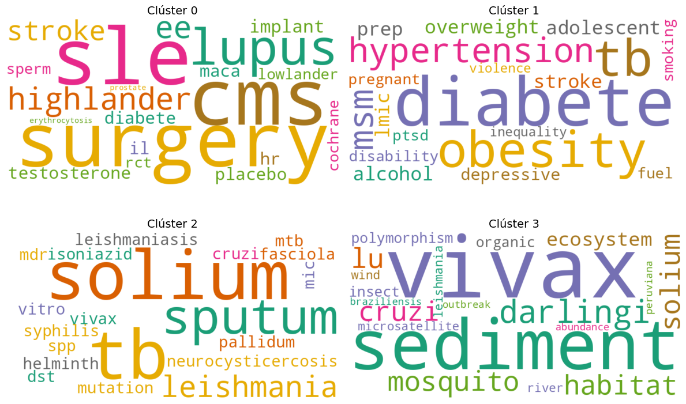

# TextMineML

Este proyecto implementa un pipeline de minería de texto usando artículos académicos recolectados desde diversas fuentes, con enfoque en preprocesamiento, vectorización y clustering.

## 🔁 Flujo de trabajo actual

1. **Recolección y preprocesamiento**
   - Se extraen artículos mediante web scraping (https://repositorio.upch.edu.pe).
   - Los textos se limpian (minúsculas, eliminación de signos de puntuación, stopwords, etc.) con `02_preprocess.py`.
   - Los resultados se guardan en `results/tables/`.

2. **Vectorización**
   Usamos tres estrategias complementarias para representar los textos como vectores numéricos:
   - **TF-IDF**
   - **Word2Vec (preentrenado)**
   - **SBERT (preentrenado)**

   El script `03_vectorize.py` genera y guarda las matrices en `results/vectorizers/`.

## 📁 Estructura del proyecto

    TextMineML/
    ├── models/ # Modelos preentrenados almacenados localmente
    ├── notebooks/ # Notebooks para exploración y pruebas
    ├── results/ # Resultados de procesamiento y vectorización
    ├── scripts/ # Scripts del pipeline
    └── README.md

## 🧠 Modelos preentrenados

### 1. Word2Vec: `wiki-news-300d-1M-subword.vec`

- 📥 **Descarga manual**:
  - URL: [https://dl.fbaipublicfiles.com/fasttext/vectors-english/wiki-news-300d-1M-subword.vec.zip](https://dl.fbaipublicfiles.com/fasttext/vectors-english/wiki-news-300d-1M-subword.vec.zip)
  - Descomprimir y mover a `models/wiki-news-300d-1M-subword.vec`.

- 📦 Formato: texto plano compatible con Gensim (`KeyedVectors.load_word2vec_format`)

### 2. SBERT: `all-mpnet-base-v2`

### 2. SBERT: `all-mpnet-base-v2`

- 📥 **Descarga desde Hugging Face**  
  https://huggingface.co/sentence-transformers/all-mpnet-base-v2/tree/main

- **Clonación manual del repositorio oficial**  
  ```bash
  cd models/
  git lfs install
  git clone https://huggingface.co/sentence-transformers/all-mpnet-base-v2
  ```

# Visualización y comparación de resultados de clustering
Este notebook carga las métricas producidas por **`04_cluster.py`**, muestra un resumen comparativo y genera gráficas 2‑D para inspeccionar visualmente la separación de clústeres con las diferentes combinaciones de *vectorizador + algoritmo*.


<div>
<style scoped>
    .dataframe tbody tr th:only-of-type {
        vertical-align: middle;
    }

    .dataframe tbody tr th {
        vertical-align: top;
    }

    .dataframe thead th {
        text-align: right;
    }
</style>
<table border="1" class="dataframe">
  <thead>
    <tr style="text-align: right;">
      <th></th>
      <th>method</th>
      <th>algo</th>
      <th>inertia</th>
      <th>silhouette</th>
      <th>db_score</th>
      <th>n_noise</th>
    </tr>
  </thead>
  <tbody>
    <tr>
      <th>22</th>
      <td>sbert</td>
      <td>kmeans4</td>
      <td>3354.803955</td>
      <td>0.114731</td>
      <td>3.661980</td>
      <td>NaN</td>
    </tr>
    <tr>
      <th>28</th>
      <td>sbert</td>
      <td>kmeans10</td>
      <td>3068.177979</td>
      <td>0.083666</td>
      <td>3.532430</td>
      <td>NaN</td>
    </tr>
    <tr>
      <th>30</th>
      <td>sbert</td>
      <td>dbscan0.4</td>
      <td>NaN</td>
      <td>0.077785</td>
      <td>3.293397</td>
      <td>356.0</td>
    </tr>
    <tr>
      <th>27</th>
      <td>sbert</td>
      <td>kmeans9</td>
      <td>3102.846924</td>
      <td>0.075858</td>
      <td>3.385208</td>
      <td>NaN</td>
    </tr>
    <tr>
      <th>26</th>
      <td>sbert</td>
      <td>kmeans8</td>
      <td>3143.183350</td>
      <td>0.072927</td>
      <td>3.544875</td>
      <td>NaN</td>
    </tr>
    <tr>
      <th>24</th>
      <td>sbert</td>
      <td>kmeans6</td>
      <td>3228.018555</td>
      <td>0.071182</td>
      <td>3.666695</td>
      <td>NaN</td>
    </tr>
    <tr>
      <th>25</th>
      <td>sbert</td>
      <td>kmeans7</td>
      <td>3184.255859</td>
      <td>0.068733</td>
      <td>3.580844</td>
      <td>NaN</td>
    </tr>
    <tr>
      <th>11</th>
      <td>w2v</td>
      <td>kmeans4</td>
      <td>30.829842</td>
      <td>0.065761</td>
      <td>3.797517</td>
      <td>NaN</td>
    </tr>
    <tr>
      <th>17</th>
      <td>w2v</td>
      <td>kmeans10</td>
      <td>28.065559</td>
      <td>0.061491</td>
      <td>3.149969</td>
      <td>NaN</td>
    </tr>
    <tr>
      <th>16</th>
      <td>w2v</td>
      <td>kmeans9</td>
      <td>28.471382</td>
      <td>0.058366</td>
      <td>3.124753</td>
      <td>NaN</td>
    </tr>
  </tbody>
</table>
</div>


### 📊 Gráfico: Silhouette por combinación

#### 📏 ¿Qué es la métrica *Silhouette*?

La métrica **Silhouette** evalúa la calidad de los clústeres generados por un algoritmo de clustering. Su valor oscila entre **-1** y **1**:

- 🟢 **Cerca de 1**: los puntos están bien agrupados dentro de su clúster y alejados de los demás. → Clustering de buena calidad
- 🟡 **Cerca de 0**: los puntos están en el límite entre clústeres. → Clustering poco definido
- 🔴 **Cerca de -1**: los puntos están probablemente mal asignados. → Clustering de mala calidad

#### 🧪 Aplicación en este proyecto

En este proyecto, calculamos la métrica *Silhouette* para cada vectorización (**TF-IDF**, **Word2Vec**, **SBERT**) combinada con cada algoritmo de clustering (**K-Means**, **DBSCAN**, **HDBSCAN**), con el fin de comparar objetivamente qué combinación agrupa mejor los textos.


    

    


## 2. Seleccionar la mejor combinación
Aquí elegimos la primera fila (mayor silhouette) como ejemplo, pero puedes cambiar manualmente los valores de `BEST_METHOD` y `BEST_ALGO`.


    Mejor combinación: sbert kmeans4


> ✅ **Comentario**: Según la métrica *Silhouette*, la mejor combinación encontrada fue **SBERT** como método de vectorización y **K-Means con k=4** como algoritmo de agrupamiento.  
Esto sugiere que SBERT logra representar los textos de forma más adecuada para la separación de clústeres, y que dividir los datos en 4 grupos produce una estructura coherente en el espacio vectorial.


### Cargar vectores y etiquetas de clustering para Mejor combinación: sbert kmeans4

En este paso cargamos los datos que serán visualizados:

- **Vectores**: Representan los documentos procesados con una técnica de vectorización (por ejemplo, TF-IDF, Word2Vec o SBERT). Están almacenados en formato `.pkl` y pueden ser matrices dispersas (*sparse*) o densas. Si son dispersas, se convierten a matrices densas (`toarray()`) para poder ser utilizadas en tareas posteriores como reducción de dimensionalidad o visualización.

- **Etiquetas de clustering**: Son los resultados de un algoritmo de agrupamiento previamente aplicado (como K-Means, DBSCAN o HDBSCAN). Están guardadas como archivos `.csv` y se leen para asociar cada documento con el clúster al que pertenece.


Vector shape: (4988, 768) | Etiquetas únicas: [0 1 2 3]


> **Salida**:
>
> `Vector shape: (4988, 768)` → 4988 documentos representados en 768 dimensiones (por ejemplo, embeddings de SBERT).  
> `Etiquetas únicas: [0 1 2 3]` → Se formaron 4 clústeres (numerados del 0 al 3).

### Reducción de dimensionalidad a 2‑D
Para poder **visualizar los clústeres** de documentos en un gráfico, es necesario reducir la representación vectorial a solo **2 dimensiones**. En este paso aplicamos técnicas de reducción de dimensionalidad sobre los vectores generados previamente:

- 📉 **UMAP** (`Uniform Manifold Approximation and Projection`) es preferido si está disponible, ya que preserva mejor la estructura local de los datos, incluso en espacios no lineales.
- 🔁 Si UMAP no está instalado, se utiliza **PCA** (`Principal Component Analysis`), que es más simple pero menos efectivo en datos con relaciones complejas.

El parámetro `n_components=2` indica que queremos reducir los vectores de 768 dimensiones a solo 2, permitiendo su representación en un plano 2D.


    


## 3. Inspección rápida del contenido de un clúster
Ejecuta la celda siguiente y cambia `CLUSTER_ID` para ver algunos títulos.


<div>
<style scoped>
    .dataframe tbody tr th:only-of-type {
        vertical-align: middle;
    }

    .dataframe tbody tr th {
        vertical-align: top;
    }

    .dataframe thead th {
        text-align: right;
    }
</style>
<table border="1" class="dataframe">
  <thead>
    <tr style="text-align: right;">
      <th></th>
      <th>title_clean_processed</th>
    </tr>
  </thead>
  <tbody>
    <tr>
      <th>0</th>
      <td>functional disability patient fibromyalgia hos...</td>
    </tr>
    <tr>
      <th>1</th>
      <td>toothbrushing access dental service peruvian c...</td>
    </tr>
    <tr>
      <th>2</th>
      <td>lancet diabete endocrinology commission type d...</td>
    </tr>
    <tr>
      <th>3</th>
      <td>experience usual family member care receive co...</td>
    </tr>
    <tr>
      <th>7</th>
      <td>political socioeconomic factor shape health ta...</td>
    </tr>
    <tr>
      <th>9</th>
      <td>strengthen evidence inform health system oppor...</td>
    </tr>
    <tr>
      <th>12</th>
      <td>burden antimicrobial resistance america cross ...</td>
    </tr>
    <tr>
      <th>13</th>
      <td>prevalence awareness treatment control high bl...</td>
    </tr>
    <tr>
      <th>15</th>
      <td>situational descriptive analysis covid pregnan...</td>
    </tr>
    <tr>
      <th>17</th>
      <td>report lancet countdown health climate change ...</td>
    </tr>
    <tr>
      <th>18</th>
      <td>sodium content commonly consume away home food...</td>
    </tr>
    <tr>
      <th>19</th>
      <td>design mobile application predict anemia</td>
    </tr>
    <tr>
      <th>21</th>
      <td>health equity access quality service care unde...</td>
    </tr>
    <tr>
      <th>22</th>
      <td>lesson learn decade datum audits international...</td>
    </tr>
    <tr>
      <th>24</th>
      <td>justice implication health food security polic...</td>
    </tr>
    <tr>
      <th>25</th>
      <td>pneumonia mortality trend child year age conte...</td>
    </tr>
    <tr>
      <th>26</th>
      <td>paper promise peruvian frontline health worker...</td>
    </tr>
    <tr>
      <th>27</th>
      <td>ongoing healthcare disparity neurohiv address ...</td>
    </tr>
    <tr>
      <th>28</th>
      <td>global variation diabetes diagnosis prevalence...</td>
    </tr>
    <tr>
      <th>29</th>
      <td>usually lot delay term come seek care expert c...</td>
    </tr>
  </tbody>
</table>
</div>


## 4. Estadísticas por clúster
En esta sección analizamos la cantidad de documentos asignados a cada clúster como resultado de la mejor combinación de vectorización y algoritmo de agrupamiento (`sbert + kmeans4`).

Utilizamos `collections.Counter` para contar cuántos documentos hay en cada clúster. Posteriormente, organizamos esta información en una tabla ordenada de mayor a menor cantidad de documentos.

Esta estadística es útil para identificar si los clústeres están equilibrados o si uno de ellos domina en tamaño, lo cual podría indicar una agrupación sesgada o una densidad temática muy concentrada.


<div>
<style scoped>
    .dataframe tbody tr th:only-of-type {
        vertical-align: middle;
    }

    .dataframe tbody tr th {
        vertical-align: top;
    }

    .dataframe thead th {
        text-align: right;
    }
</style>
<table border="1" class="dataframe">
  <thead>
    <tr style="text-align: right;">
      <th></th>
      <th>n_documentos</th>
    </tr>
  </thead>
  <tbody>
    <tr>
      <th>1</th>
      <td>1952</td>
    </tr>
    <tr>
      <th>2</th>
      <td>1328</td>
    </tr>
    <tr>
      <th>0</th>
      <td>1075</td>
    </tr>
    <tr>
      <th>3</th>
      <td>633</td>
    </tr>
  </tbody>
</table>
</div>


#### Visualización de la distribución
El gráfico de barras muestra cuántos artículos fueron asignados a cada clúster. Esta representación visual facilita la detección de desbalance en la agrupación. Por ejemplo, un clúster con muy pocos documentos puede sugerir un grupo temáticamente muy específico o ruido.

En nuestro caso, se observa que el clúster `1` contiene la mayor cantidad de documentos (~1139), mientras que el clúster `3` es el más pequeño (~512).

`


    

    


### Estadísticas por clúster: frecuencia de palabras

Una vez identificados los clústeres a partir de la mejor combinación (`sbert` + `kmeans4`), es fundamental explorar su contenido temático.

#### 🔹 Conteo de palabras por clúster

Se seleccionan todos los textos pertenecientes a un clúster específico (por ejemplo, el clúster 1) y se realiza un conteo de las palabras más frecuentes. Esto permite identificar rápidamente los términos predominantes dentro del grupo.

La tabla muestra las 20 palabras más frecuentes en el clúster. En este caso, destacan términos como `health`, `use`, `study`, `peru` y `risk`, lo que sugiere que los artículos agrupados en este clúster tratan temas de salud pública, investigación médica y contexto local (Perú).


<div>
<style scoped>
    .dataframe tbody tr th:only-of-type {
        vertical-align: middle;
    }

    .dataframe tbody tr th {
        vertical-align: top;
    }

    .dataframe thead th {
        text-align: right;
    }
</style>
<table border="1" class="dataframe">
  <thead>
    <tr style="text-align: right;">
      <th></th>
      <th>Palabra</th>
      <th>Frecuencia</th>
    </tr>
  </thead>
  <tbody>
    <tr>
      <th>0</th>
      <td>health</td>
      <td>3272</td>
    </tr>
    <tr>
      <th>1</th>
      <td>use</td>
      <td>2730</td>
    </tr>
    <tr>
      <th>2</th>
      <td>study</td>
      <td>2510</td>
    </tr>
    <tr>
      <th>3</th>
      <td>high</td>
      <td>2022</td>
    </tr>
    <tr>
      <th>4</th>
      <td>year</td>
      <td>1767</td>
    </tr>
    <tr>
      <th>5</th>
      <td>ci</td>
      <td>1630</td>
    </tr>
    <tr>
      <th>6</th>
      <td>country</td>
      <td>1592</td>
    </tr>
    <tr>
      <th>7</th>
      <td>peru</td>
      <td>1589</td>
    </tr>
    <tr>
      <th>8</th>
      <td>result</td>
      <td>1561</td>
    </tr>
    <tr>
      <th>9</th>
      <td>risk</td>
      <td>1525</td>
    </tr>
    <tr>
      <th>10</th>
      <td>age</td>
      <td>1376</td>
    </tr>
    <tr>
      <th>11</th>
      <td>low</td>
      <td>1316</td>
    </tr>
    <tr>
      <th>12</th>
      <td>method</td>
      <td>1268</td>
    </tr>
    <tr>
      <th>13</th>
      <td>associate</td>
      <td>1261</td>
    </tr>
    <tr>
      <th>14</th>
      <td>patient</td>
      <td>1187</td>
    </tr>
    <tr>
      <th>15</th>
      <td>care</td>
      <td>1186</td>
    </tr>
    <tr>
      <th>16</th>
      <td>population</td>
      <td>1162</td>
    </tr>
    <tr>
      <th>17</th>
      <td>prevalence</td>
      <td>1118</td>
    </tr>
    <tr>
      <th>18</th>
      <td>include</td>
      <td>1084</td>
    </tr>
    <tr>
      <th>19</th>
      <td>woman</td>
      <td>1079</td>
    </tr>
  </tbody>
</table>
</div>


#### 🔹 Visualización

El gráfico de barras horizontales permite visualizar de forma clara la importancia relativa de cada palabra. Esta representación facilita detectar rápidamente los temas clave del clúster sin necesidad de leer todos los documentos uno por uno.

Esta etapa de análisis es crucial para validar que los clústeres obtenidos no solo son estadísticamente consistentes, sino también **coherentes desde el punto de vista semántico**.

    

    


### 📌 Distribución temática por clúster: palabras clave más frecuentes

La siguiente visualización muestra un análisis comparativo de los términos más frecuentes en cada clúster generado mediante la mejor combinación (`SBERT + KMeans` con k=4). Cada gráfico horizontal resume las 20 palabras con mayor frecuencia dentro de los documentos agrupados en ese clúster.

#### 🔹 Clúster 0
Este clúster está dominado por términos como `patient`, `study`, `use`, `high`, `result`, y `clinical`, lo que sugiere una agrupación centrada en estudios clínicos y resultados de tratamientos.

#### 🔹 Clúster 1
Aquí predominan palabras como `health`, `use`, `study`, `peru`, `population`, y `woman`. El énfasis está claramente en estudios de salud pública con enfoque local (Perú) y con perspectiva poblacional, posiblemente con enfoque de género.

#### 🔹 Clúster 2
Se destacan términos como `infection`, `treatment`, `tuberculosis`, `resistance`, y `clinical`, lo cual apunta a temas relacionados con enfermedades infecciosas, tratamientos y estudios clínicos asociados, especialmente tuberculosis.

#### 🔹 Clúster 3
Este grupo contiene palabras como `malaria`, `species`, `transmission`, `region`, y `genetic`, sugiriendo una temática enfocada en enfermedades infecciosas tropicales (como malaria) y su análisis genético y geográfico.

---

✅ Esta segmentación temática demuestra que los clústeres no solo son diferenciables matemáticamente, sino también **semánticamente interpretables**, lo cual valida la calidad del proceso de clustering y su utilidad para exploración de grandes volúmenes de texto.


    

    


## 5. Resumen cualitativo rápido (títulos representativos)
### Para entender de qué trata cada clúster, podemos inspeccionar 5–10 títulos del grupo:


    ['functional disability patient fibromyalgia hospital lima peru',
     'toothbrushing access dental service peruvian child',
     'lancet diabete endocrinology commission type diabete look forward',
     'experience usual family member care receive community metal health center lima callao covid pandemic',
     'political socioeconomic factor shape health taxis implementation peru',
     'strengthen evidence inform health system opportunity partner accelerate progress non communicable disease',
     'burden antimicrobial resistance america cross country systematic analysis',
     'prevalence awareness treatment control high blood pressure cohort northern andean peru',
     'situational descriptive analysis covid pregnant woman perinatal outcome lircay hospital huancavelica peru april',
     'report lancet countdown health climate change imperative health centre response world face irreversible harm']


## 7. Tabla de palabras-clave por clúster

En esta sección buscamos identificar las **palabras más representativas de cada clúster** utilizando la técnica TF-IDF.

#### Idea principal:
Cada clúster es tratado como un “super-documento” al unir todos los abstracts de sus artículos. Luego se aplica TF-IDF, comparando estos super-documentos entre sí.

#### ¿Por qué usar TF-IDF aquí?
TF-IDF nos permite destacar aquellas palabras que:
- Son frecuentes dentro de un clúster (alta frecuencia local),
- Pero que no aparecen tan frecuentemente en los demás clústeres (baja frecuencia global).

Así obtenemos **palabras clave únicas por clúster**, lo que permite interpretar y etiquetar temáticamente a cada grupo.

#### Nota:
Continuamos usando la mejor combinación obtenida anteriormente (`{BEST_METHOD}` + `{BEST_ALGO}`) para garantizar coherencia en todo el análisis.


Vector shape: (4988, 768) | Etiquetas únicas: [0 1 2 3]


<div>
<style scoped>
    .dataframe tbody tr th:only-of-type {
        vertical-align: middle;
    }

    .dataframe tbody tr th {
        vertical-align: top;
    }

    .dataframe thead th {
        text-align: right;
    }
</style>
<table border="1" class="dataframe">
  <thead>
    <tr style="text-align: right;">
      <th></th>
      <th>0</th>
      <th>1</th>
      <th>2</th>
      <th>3</th>
      <th>4</th>
      <th>5</th>
      <th>6</th>
      <th>7</th>
      <th>8</th>
      <th>9</th>
      <th>10</th>
      <th>11</th>
      <th>12</th>
      <th>13</th>
      <th>14</th>
    </tr>
  </thead>
  <tbody>
    <tr>
      <th>0</th>
      <td>patient</td>
      <td>study</td>
      <td>high</td>
      <td>use</td>
      <td>result</td>
      <td>increase</td>
      <td>group</td>
      <td>disease</td>
      <td>clinical</td>
      <td>associate</td>
      <td>treatment</td>
      <td>level</td>
      <td>risk</td>
      <td>year</td>
      <td>method</td>
    </tr>
    <tr>
      <th>1</th>
      <td>health</td>
      <td>use</td>
      <td>study</td>
      <td>high</td>
      <td>year</td>
      <td>ci</td>
      <td>country</td>
      <td>peru</td>
      <td>result</td>
      <td>risk</td>
      <td>age</td>
      <td>low</td>
      <td>method</td>
      <td>associate</td>
      <td>patient</td>
    </tr>
    <tr>
      <th>2</th>
      <td>patient</td>
      <td>study</td>
      <td>infection</td>
      <td>use</td>
      <td>treatment</td>
      <td>result</td>
      <td>disease</td>
      <td>tb</td>
      <td>test</td>
      <td>high</td>
      <td>case</td>
      <td>sample</td>
      <td>tuberculosis</td>
      <td>isolate</td>
      <td>method</td>
    </tr>
    <tr>
      <th>3</th>
      <td>study</td>
      <td>high</td>
      <td>population</td>
      <td>use</td>
      <td>specie</td>
      <td>peru</td>
      <td>malaria</td>
      <td>result</td>
      <td>analysis</td>
      <td>sample</td>
      <td>peruvian</td>
      <td>human</td>
      <td>area</td>
      <td>vivax</td>
      <td>region</td>
    </tr>
  </tbody>
</table>
</div>


### 🔍 Interpretación de **`keywords_by_cluster.csv`**

| Clúster | Palabras clave más discriminativas | Tema dominante (lectura cualitativa) |
|---------|-------------------------------------|--------------------------------------|
| **0** | patient · study · high · use · result · increase · group · disease · clinical · associate · treatment · level · risk · year · method | **Investigaciones clínicas generales** centradas en pacientes, tratamientos y resultados de salud diversos. |
| **1** | health · use · study · high · year · ci · country · peru · result · risk · age · low · method · associate · patient | **Salud pública / epidemiología peruana**: encuestas poblacionales, factores de riesgo y acceso a servicios. |
| **2** | patient · study · infection · use · treatment · result · disease · tb · test · high · case · sample · tuberculosis · isolate · method | **Tuberculosis e infecciones respiratorias**: diagnóstico, aislamiento y estudios de casos TB. |
| **3** | study · high · population · use · specie · peru · malaria · result · analysis · sample · peruvian · human · area · vivax · region | **Enfermedades tropicales** (p.ej. malaria *P. vivax*) y estudios poblacionales en regiones peruanas. |


**Detalles**  
> * Cada fila corresponde a un clúster (salida de **SBERT + K-means k=4**).  
> * Se muestran las 15 palabras con TF-IDF más alto; cuanto más arriba, más distintiva es para el grupo.  
> * La interpretación temática se basa en patrones: nombres de patógenos, términos clínicos, referencias geográficas, etc.

**Conclusión**  
El modelo separa los 4 998 artículos en cuatro áreas coherentes:  
1. Clínica general,  
2. Salud pública peruana,  
3. Tuberculosis,  
4. Malaria/enfermedades tropicales.  

Esto confirma que la combinación **SBERT + K-means k=4** ofrece clústeres interpretables y útiles para análisis posteriores.


## 8. Documento **más representativo** de cada clúster  
#### (el más cercano al centroide en el espacio de embeddings)

> **Objetivo:** elegir, para cada clúster, **un único artículo** que resuma el perfil temático del grupo.  
> Este “documento prototipo” permite inspeccionar rápidamente de qué trata cada clúster sin leer cientos de abstracts.

---

### 🛠️  Metodología

1. **Vectorización usada**  
   Continuamos con la mejor configuración identificada: **SBERT + K-means k=4**.  
   Cada artículo está representado por un vector de 768 dimensiones (embeddings SBERT).

2. **Centroides de clúster**  
   Para cada clúster \(c\), el algoritmo K-means ya calcula su **centroide**  
   \[
   \boldsymbol{\mu}_c = \frac{1}{N_c}\sum_{i\in c}\mathbf{x}_i
   \]  
   donde \(N_c\) es el número de documentos y \(\mathbf{x}_i\) su embedding.

3. **Distancia al centroide**  
   - Medimos la **distancia coseno** entre cada documento y el centroide de su clúster.  
   - El documento con **menor distancia** (o, equivalentemente, mayor similitud coseno) es el **representante** del clúster.


<div>
<style scoped>
    .dataframe tbody tr th:only-of-type {
        vertical-align: middle;
    }

    .dataframe tbody tr th {
        vertical-align: top;
    }

    .dataframe thead th {
        text-align: right;
    }
</style>
<table border="1" class="dataframe">
  <thead>
    <tr style="text-align: right;">
      <th></th>
      <th>cluster_id</th>
      <th>doc_index</th>
      <th>cosine_sim</th>
      <th>title</th>
      <th>link</th>
    </tr>
  </thead>
  <tbody>
    <tr>
      <th>0</th>
      <td>0</td>
      <td>3818</td>
      <td>0.762037</td>
      <td>author report lack time main reason unpublished research present biomedical conference systematic review</td>
      <td>None</td>
    </tr>
    <tr>
      <th>1</th>
      <td>1</td>
      <td>3332</td>
      <td>0.875588</td>
      <td>manipulation analysis display datum demographic family health survey program</td>
      <td>None</td>
    </tr>
    <tr>
      <th>2</th>
      <td>2</td>
      <td>881</td>
      <td>0.779278</td>
      <td>tuberculosis covid time successful treatment result peru</td>
      <td>None</td>
    </tr>
    <tr>
      <th>3</th>
      <td>3</td>
      <td>3967</td>
      <td>0.802446</td>
      <td>evidence temporal population replacement signature ecological adaptation major neotropical malaria vector amazonian peru</td>
      <td>None</td>
    </tr>
  </tbody>
</table>
</div>


### 🗒️  Resultado obtenido

La tabla inferior resume el **artículo prototipo** seleccionado para cada uno de los 4 clústeres (SBERT + K-means k = 4):

| Clúster | Doc. índice | Similitud coseno | Título (resumido) |
|:-------:|:-----------:|:----------------:|-------------------|
| **0** | 3818 | 0.76 | *author report lack time main reason unpublished research…* |
| **1** | 3332 | **0.88** | *manipulation analysis display datum demographic family health survey…* |
| **2** | 881 | 0.78 | *tuberculosis covid time successful treatment result peru* |
| **3** | 3967 | 0.80 | *evidence temporal population replacement signature ecological adaptation major neotropical malaria vector amazonian peru* |

#### 🔍 Lectura rápida

* **Clúster 0 — “Publicación de investigación biomédica”**  
  El prototipo trata sobre las razones que impiden publicar trabajos presentados en congresos, sugiriendo un foco en *divulgación científica y barreras de publicación*.

* **Clúster 1 — “Análisis demográfico y encuestas de salud”**  
  Presenta la similitud más alta (0.88), lo que indica un núcleo muy cohesionado de artículos sobre *explotación de encuestas poblacionales* y métricas de salud pública.

* **Clúster 2 — “Tuberculosis y COVID-19”**  
  El título refleja resultados de tratamiento en Perú, confirmando que este grupo agrupa *enfermedades infecciosas respiratorias* y *salud clínica*.

* **Clúster 3 — “Malaria y vectores amazónicos”**  
  Centrado en la evolución del vector *Anopheles darlingi* en la Amazonía, sugiere un clúster temático de *malaria, ecología y adaptación de vectores*.

####  Cómo interpretar los valores

* **`cosine_sim`** ≈ 1 ⇒ el documento «representa» muy bien a su clúster.  
  En nuestro caso, todos superan 0.75, lo cual indica que los centroides están bien definidos.

* **`doc_index`** es la fila original en la matriz de embeddings; sirve para recuperar el abstract completo o metadatos adicionales.

Estas cuatro referencias proporcionan una **visión instantánea** de los temas dominantes en el corpus. Para una exploración más profunda, basta con revisar estos artículos antes de pasar a lecturas exhaustivas o análisis cualitativos.


### 9. Palabras clave distintivas por clúster  


<div>
<style scoped>
    .dataframe tbody tr th:only-of-type {
        vertical-align: middle;
    }

    .dataframe tbody tr th {
        vertical-align: top;
    }

    .dataframe thead th {
        text-align: right;
    }
</style>
<table border="1" class="dataframe">
  <thead>
    <tr style="text-align: right;">
      <th></th>
      <th>0</th>
      <th>1</th>
      <th>2</th>
      <th>3</th>
      <th>4</th>
      <th>5</th>
      <th>6</th>
      <th>7</th>
      <th>8</th>
      <th>9</th>
      <th>10</th>
      <th>11</th>
      <th>12</th>
      <th>13</th>
      <th>14</th>
      <th>15</th>
      <th>16</th>
      <th>17</th>
      <th>18</th>
      <th>19</th>
    </tr>
    <tr>
      <th>cluster_id</th>
      <th></th>
      <th></th>
      <th></th>
      <th></th>
      <th></th>
      <th></th>
      <th></th>
      <th></th>
      <th></th>
      <th></th>
      <th></th>
      <th></th>
      <th></th>
      <th></th>
      <th></th>
      <th></th>
      <th></th>
      <th></th>
      <th></th>
      <th></th>
    </tr>
  </thead>
  <tbody>
    <tr>
      <th>0</th>
      <td>cms</td>
      <td>sle</td>
      <td>surgery</td>
      <td>lupus</td>
      <td>highlander</td>
      <td>ee</td>
      <td>stroke</td>
      <td>implant</td>
      <td>placebo</td>
      <td>maca</td>
      <td>testosterone</td>
      <td>diabete</td>
      <td>hr</td>
      <td>il</td>
      <td>lowlander</td>
      <td>cochrane</td>
      <td>sperm</td>
      <td>rct</td>
      <td>erythrocytosis</td>
      <td>prostate</td>
    </tr>
    <tr>
      <th>1</th>
      <td>tb</td>
      <td>obesity</td>
      <td>diabete</td>
      <td>hypertension</td>
      <td>msm</td>
      <td>overweight</td>
      <td>alcohol</td>
      <td>lmic</td>
      <td>adolescent</td>
      <td>prep</td>
      <td>stroke</td>
      <td>diabetes</td>
      <td>depressive</td>
      <td>disability</td>
      <td>pregnant</td>
      <td>ptsd</td>
      <td>fuel</td>
      <td>smoking</td>
      <td>inequality</td>
      <td>violence</td>
    </tr>
    <tr>
      <th>2</th>
      <td>tb</td>
      <td>solium</td>
      <td>sputum</td>
      <td>leishmania</td>
      <td>neurocysticercosis</td>
      <td>cruzi</td>
      <td>mutation</td>
      <td>vivax</td>
      <td>mtb</td>
      <td>mdr</td>
      <td>leishmaniasis</td>
      <td>mic</td>
      <td>spp</td>
      <td>fasciola</td>
      <td>dst</td>
      <td>pallidum</td>
      <td>helminth</td>
      <td>syphilis</td>
      <td>vitro</td>
      <td>isoniazid</td>
    </tr>
    <tr>
      <th>3</th>
      <td>vivax</td>
      <td>sediment</td>
      <td>darlingi</td>
      <td>mosquito</td>
      <td>lu</td>
      <td>habitat</td>
      <td>cruzi</td>
      <td>solium</td>
      <td>ecosystem</td>
      <td>polymorphism</td>
      <td>insect</td>
      <td>organic</td>
      <td>microsatellite</td>
      <td>river</td>
      <td>leishmania</td>
      <td>wind</td>
      <td>braziliensis</td>
      <td>outbreak</td>
      <td>peruviana</td>
      <td>abundance</td>
    </tr>
  </tbody>
</table>
</div>


| cluster_id | 0 | 1 | 2 | 3 | 4 | … | 19 |
|-----------:|---|---|---|---|---|---|----|
| **0** | cms | sle | surgery | lupus | highlander | … | prostate |
| **1** | tb | obesity | diabetes | hypertension | msm | … | violence |
| **2** | tb | solium | sputum | leishmania | neurocysticercosis | … | isoniazid |
| **3** | vivax | sediment | darlingi | mosquito | habitat | … | abundance |


**Detalles**  
> *Cada fila* corresponde a un clúster y muestra sus **20 términos TF-IDF con mayor peso**.  
> Estas palabras destacan porque son **frecuentes dentro del grupo pero poco comunes en los demás**, por lo que “definen” el tema central de cada clúster.

---

#### Lectura rápida de los temas

| Clúster | Indicadores léxicos | Posible temática |
|---------|--------------------|------------------|
| **0** | *cms, sle, surgery, lupus, stroke, implant, placebo…* | Cirugía / ensayos clínicos en enfermedades autoinmunes y cardiovasculares. |
| **1** | *tb, obesity, diabetes, hypertension, adolescent, smoking, inequality…* | Salud pública y factores de riesgo metabólicos/infecciosos en poblaciones LMIC. |
| **2** | *tb, solium, leishmania, neurocysticercosis, mutation, mdr, isoniazid…* | Enfermedades infecciosas y parasitarias (TB, helmintos) + resistencia antimicrobiana. |
| **3** | *vivax, mosquito, darlingi, habitat, ecosystem, polymorphism, abundance…* | Malaria y ecología de vectores en entornos amazónicos. |

---

#### Cómo podemos aprovechar esta tabla

* **Etiquetado rápido**: los investigadores pueden asignar nombres significativos a los clústeres sin leer todos los artículos.  
* **Filtrado temático**: seleccionar documentos que contengan alguna de estas palabras para profundizar en sub-temas de interés.  
* **Validación del clustering**: si las palabras clave no guardan coherencia temática, puede ser señal de revisar parámetros (k, algoritmo, pre-procesado).

> **Nota metodológica**  
> Las palabras se obtuvieron concatenando los abstracts de cada clúster en un “super-documento” y aplicando **TF-IDF entre clústeres**.  
> Se muestran los 20 términos con valores TF-IDF más altos por fila.


# Word-clouds de las *palabras clave distintivas* por clúster 


    

    

